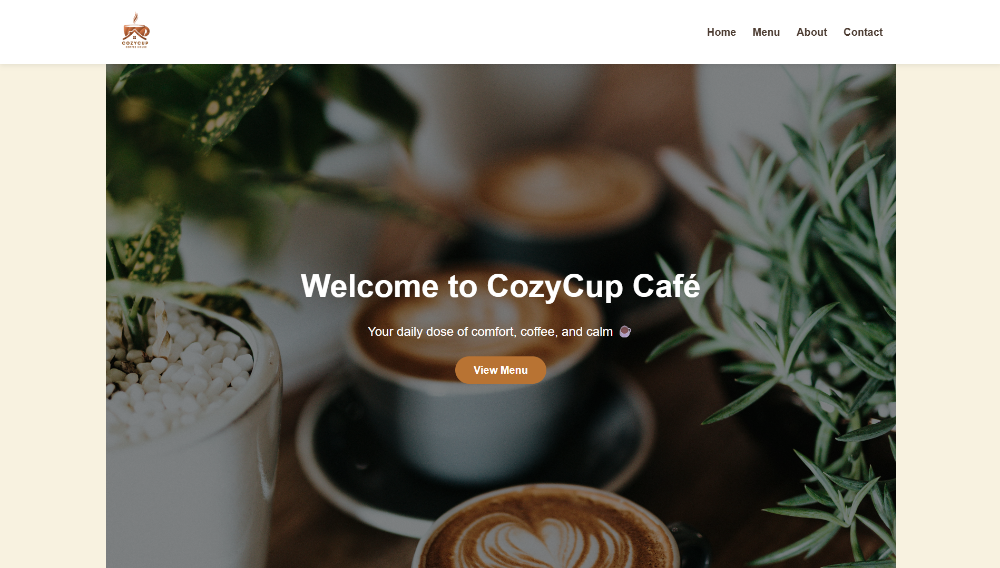
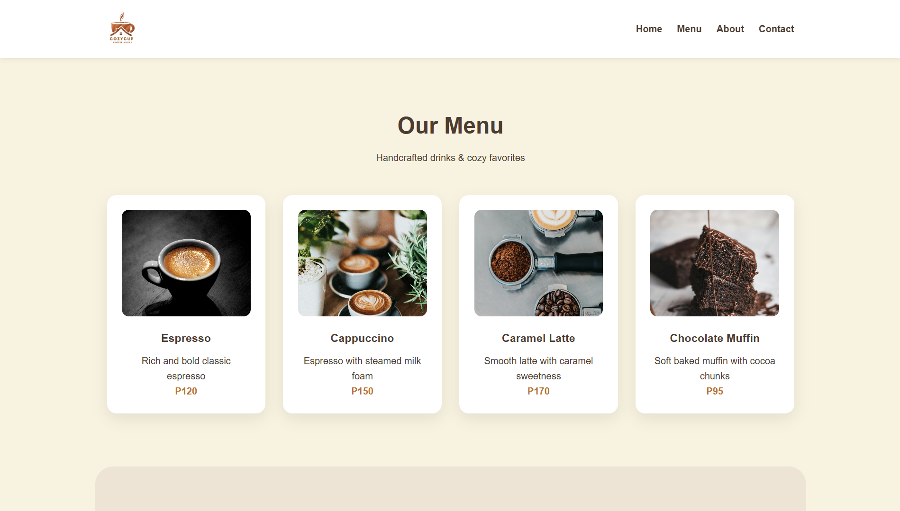
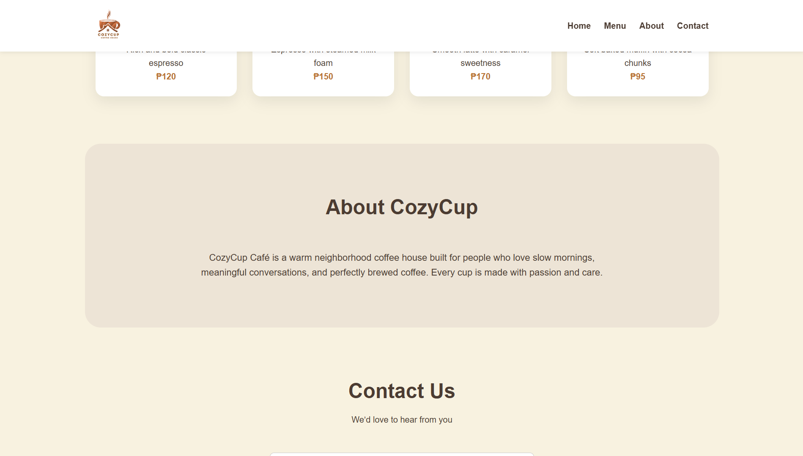
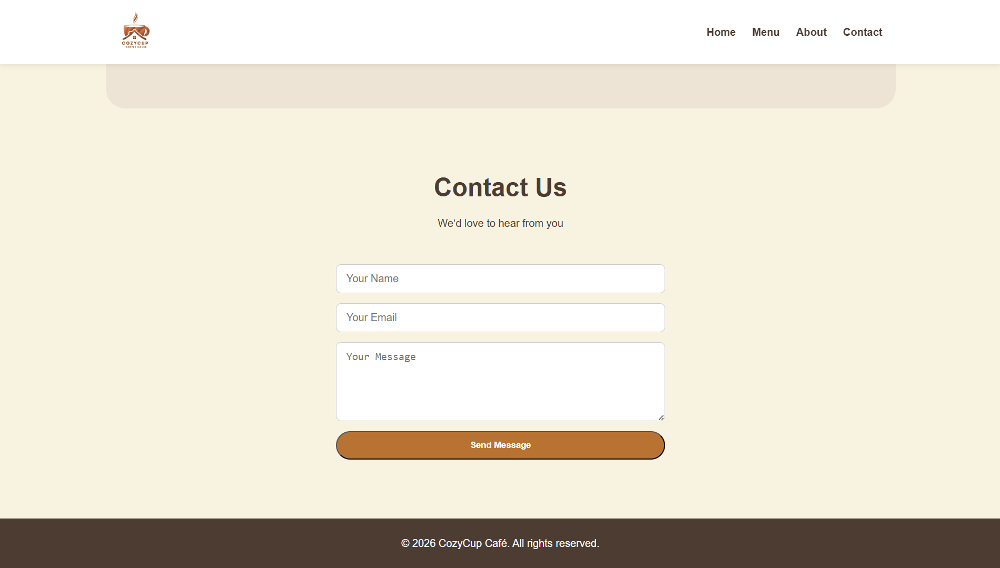

# Cozy Cup Cafe

## Project Description
Cozy Cup Cafe is a simple web-based project designed to showcase a cozy café experience. The system presents the café’s offerings, ambiance, and essential information through a clean and user-friendly interface.

## Features
- Clean and simple café website layout  
- Menu display for drinks and food items  
- Informational pages about the café  
- Easy navigation for users  
- Responsive design for different screen sizes  

## Screen Captures

  
**Home Page** – Displays the main landing page of the Cozy Cup Cafe website.

  
**Menu Page** – Shows the available food and beverage offerings of the café.

  
**About Page** – Provides background information and the concept of Cozy Cup Cafe.

  
**Contact Page** – Displays contact details and other ways to reach the café.

## About the Authors

### Author 1

**Name:** Michael Alfred J. Paalan  
**Email:** miko.paalan@gmail.com  

---

### Author 2

**Name:** Pia Luisa G. Tolon  
**Email:** piaaluisaa@gmail.com

